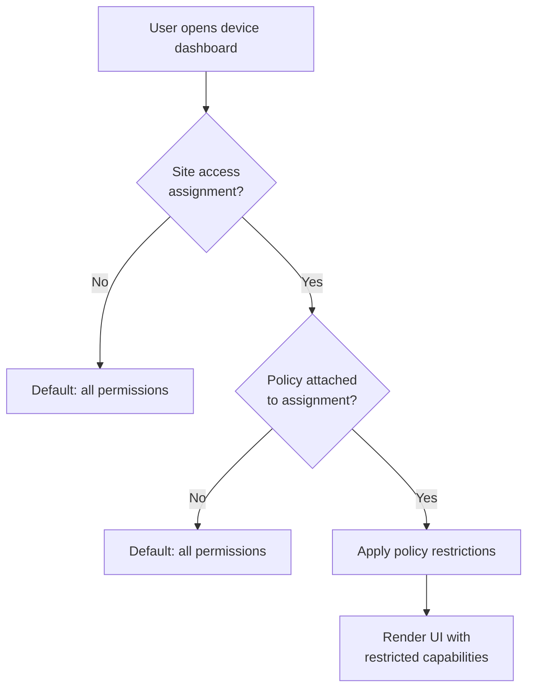

# Access Policies

Access policies give **customer admins** fine-grained control over what each user can do on which site. By default, all logged-in users can do everything. Policies restrict specific capabilities.

## How policies work

Policies are applied at the **user + site** level. The same user can have full access to Site A but view-only on Site B.

## Manage policies

Navigate to **Settings → Access Policies** (requires admin role).

> **Screenshot:** *Access Policy Editor page: left panel lists three policies: "Full Access", "Engineer View", "Alarm Only". Right panel shows selected policy details with toggle switches for each permission.*

### Available permissions

| Permission | When restricted | UI behavior |
|------------|-----------------|------------|
| `allow_hmi` | HOTRACO Direct HMI disabled | HMI section hidden |
| `allow_vnc` | VNC Connect button disabled | Button grayed out |
| `allow_http` | HTTP Connect button disabled | Button grayed out |
| `allow_alarms_view` | Alarm panel hidden | Replaced with policy warning |
| `allow_alarms_acknowledge` | Acknowledge button hidden | No button shown |
| `allow_audit_view` | Event log hidden | Replaced with policy warning |

### Alarm severity filter

Additionally, you can restrict which alarm severities a user sees:

| Setting | Effect |
|---------|--------|
| All (default) | User sees all alarms |
| Warning and above | Info alarms are hidden |
| Critical only | Only critical alarms visible |

## Assign a policy to a user

1. Go to **Settings → Site Access** (admin only)
2. Select a site
3. Choose a user from your tenant
4. Select their role (Engineer / Viewer) and optionally attach a policy
5. Save

> **Screenshot:** *Site Access page: table of users with columns User, Email, Role, Access Policy. One user has "Full Access" policy, another has "Alarm Only". Edit and Remove buttons per row.*

::: tip Default permissive behavior
If you haven't configured any policies, every user in your tenant has full access to all devices. Start with policies only when you need to restrict specific staff (e.g. external technicians from a service company).
:::

## Seeding default policies

If you're starting fresh, click **Seed default policies** to create three starter policies:

| Policy name | What it allows |
|-------------|---------------|
| Full Access | Everything (same as no policy) |
| Engineer | HMI + VNC + HTTP + alarms + acknowledge (no audit log) |
| Alarm Monitor | Alarm view only (no remote access) |
