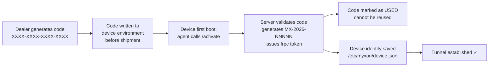

# Activation Codes (Scenario 2)

Activation codes are the provisioning mechanism for **OEM partners** whose devices have an embedded Linux server. Instead of pre-registering a serial number, you generate a one-time code and deploy it to the device. The device self-registers on first boot.

## How activation codes work



A code can only activate **one device**. Once used, it is permanently consumed. If a device is wiped and re-flashed, you need a new code.

## Generate a code

1. Open **Dealer Portal → Activation Codes** tab
2. Optionally enter a **Device label** — a human-readable name to identify this code's purpose (e.g. "Farm Noord unit #3")
3. Select the **validity period** (7, 14, 30, or 90 days)
4. Click **+ Generate**

> **Screenshot:** *"Generate Activation Code" form with device label input, TTL dropdown (7 days selected), Generate button. Helper text: "Generate a one-time code for OEM partner devices."*

## Copy the code

After generation, the code appears in a highlighted panel:

> **Screenshot:** *Generated code panel: large monospace code "A3F1-B2E4-C9D7-0F56" in a dark box, "Copy" button on the right. Below: device label, expiry date, and instruction to set MYXON_ACTIVATION_CODE env var.*

::: danger Copy it now
The plain text code is shown only once in this panel. After you dismiss or refresh, you can still see the code in the list below — but make sure to copy it before deploying.
:::

Set the code as an environment variable on the device (see [OEM: Quick install](/oem/install)):
```bash
MYXON_ACTIVATION_CODE=A3F1-B2E4-C9D7-0F56
```

## Code list

All codes for your tenant are shown in the table:

> **Screenshot:** *Code table with columns: Code (monospace), Label, Status badge (Pending/Used/Expired), Expiry date, Revoke button.*

| Status | Meaning |
|--------|---------|
| **Pending** | Code generated, device not yet activated |
| **Used** | Device successfully self-registered with this code |
| **Expired** | Validity period passed before the device connected |

## Revoke a code

You can revoke any **Pending** code that hasn't been used yet. This is useful if a code was lost, sent to the wrong device, or the shipment was cancelled.

Click **Revoke** next to the code in the list. Used and expired codes cannot be revoked — they are already consumed.

::: info Code security
Each code is a 128-bit cryptographically random token in `XXXX-XXXX-XXXX-XXXX` format. Even if someone obtains a code, they can only use it once, and only before it expires.
:::
