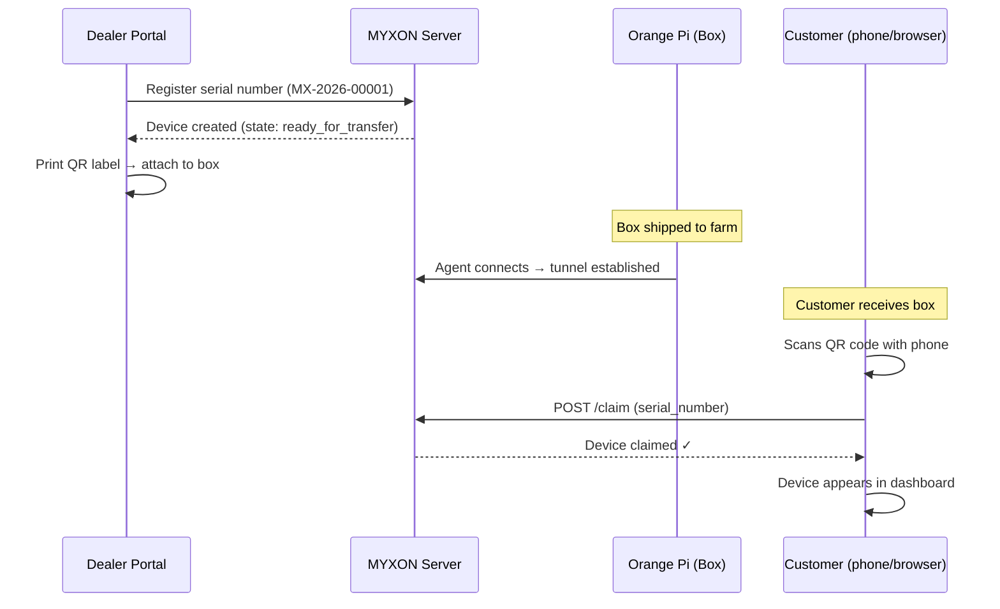
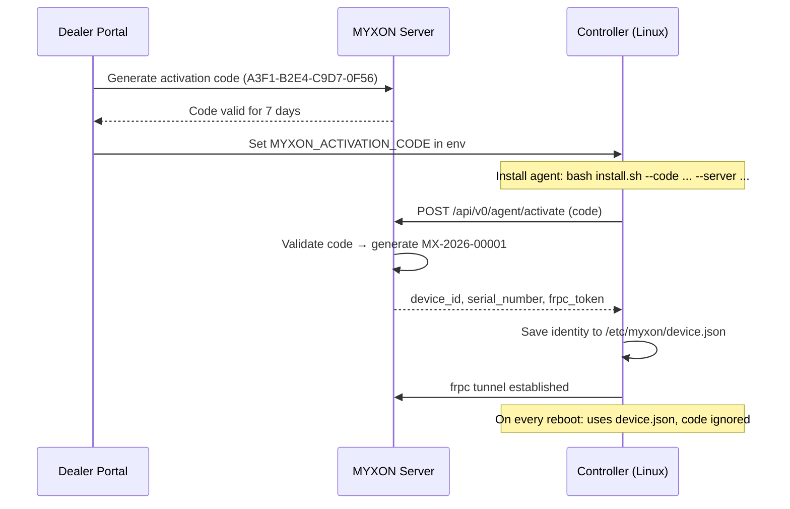

# Two deployment scenarios

MYXON supports two distinct business scenarios. Choose the one that matches your product.

## Scenario 1 — MYXON Box

**You sell hardware. The agent is pre-installed.**

This is the typical reseller model. You source Orange Pi boards, flash your Debian image with the MYXON agent, and ship the box to the customer alongside their controller.

### Flow

### Who does what

| Step | Who | Tool |
|------|-----|------|
| Register serial | Dealer | Dealer Portal → Devices tab |
| Print QR | Dealer | Dealer Portal → Print QR Label |
| Ship box | Dealer | Physical delivery |
| Flash firmware + connect | Dealer / technician | On-site |
| Scan QR & claim | Customer | Mobile browser |

### Advantages
- Simple for the customer — one QR scan activates everything
- Works even if device is offline at claim time (claim is just ownership transfer)
- Dealer can pre-register hundreds of serials in bulk

---

## Scenario 2 — OEM SDK

**Your controller already has Linux on board. You embed the agent.**

This is the OEM integration model. You manufacture a controller (SCOV, Stienen, or your own brand) that ships with an embedded Linux server. You install the MYXON agent alongside your existing software.

### Flow

### Who does what

| Step | Who | Tool |
|------|-----|------|
| Generate activation code | Dealer | Dealer Portal → Activation Codes tab |
| Run `install.sh` on device | Technician / factory | SSH or OS image provisioning |
| First boot → auto-register | Agent (automatic) | No human action needed |
| Monitor fleet | Dealer | Dealer Portal → Devices tab |

### Advantages
- No need to pre-register serial numbers — server generates them
- Works in factory / bulk provisioning pipelines
- Activation code is truly one-time use — cannot be replayed

---

## Comparison

| Feature | Scenario 1 (MYXON Box) | Scenario 2 (OEM SDK) |
|---------|------------------------|----------------------|
| Hardware | Your Orange Pi product | Partner's controller |
| Agent install | Pre-installed in image | `install.sh` by partner |
| Registration | Dealer pre-registers serial | Code generated per device |
| Customer activation | QR code scan | Automatic on first boot |
| Serial number source | Dealer assigns | Server auto-generates |
| Customer claim step | Required | Optional (device already claimed) |
