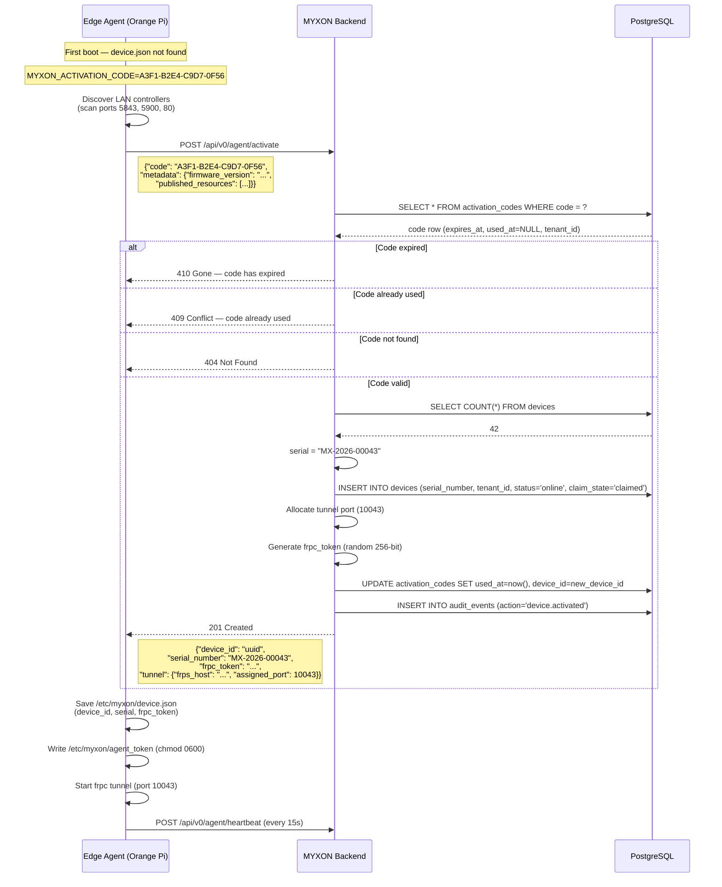

# Activation Code Flow — Technical Reference

This page explains the exact API interaction during device self-registration for developers and integrators who need to understand or extend the flow.

## Full sequence



## API endpoint

```
POST /api/v0/agent/activate
Content-Type: application/json
(no Authorization header required)
```

### Request body

```typescript
{
  code: string              // Activation code: "XXXX-XXXX-XXXX-XXXX"
  metadata?: {
    firmware_version?: string
    hardware_info?: string
    model?: string
    published_resources?: Resource[]
  }
}

interface Resource {
  id: string           // e.g. "remote-plus"
  protocol: string     // "tcp" | "vnc" | "http"
  host: string         // LAN IP of the controller
  port: number         // LAN port
  name: string         // Human-readable name
}
```

### Response (201 Created)

```typescript
{
  accepted: true
  device_id: string          // UUID of newly created device
  serial_number: string      // Generated: "MX-2026-00043"
  frpc_token: string         // Store this — never sent again
  tunnel: {
    frps_host: string        // frps server hostname
    frps_port: number        // frps bind port (default 7000)
    assigned_port: number    // Unique port for this device's tunnel
    subdomain: string | null // Optional subdomain routing
  }
}
```

### Error responses

| Status | When |
|--------|------|
| `404 Not Found` | Code does not exist |
| `409 Conflict` | Code already used by another device |
| `410 Gone` | Code has expired |

## Serial number format

Serial numbers are generated automatically:

```
MX-{YEAR}-{SEQUENCE}
```

- `{YEAR}` — 4-digit activation year
- `{SEQUENCE}` — 5-digit zero-padded count of devices at time of activation

Example: `MX-2026-00043` — 43rd device activated in 2026.

::: warning Not a true DB sequence
The current implementation uses `SELECT COUNT(*) FROM devices` to determine the next number. In high-concurrency scenarios (multiple activations at exactly the same time), there is a small chance of collision — the database unique constraint will reject the duplicate and the device will see a 500 error and retry. For typical OEM deployments (one device at a time), this is not a concern.
:::

## Security properties

| Property | How it's enforced |
|----------|-----------------|
| One-time use | `used_at` is set on first use; server rejects subsequent calls |
| Expiry | `expires_at` is checked server-side on every request |
| No auth required | The code IS the proof of authorization |
| frpc_token issued once | Returned only in the 201 response; subsequent registrations use it without re-issuing |
| Token stored securely | Saved to `chmod 0600` file; never logged |
