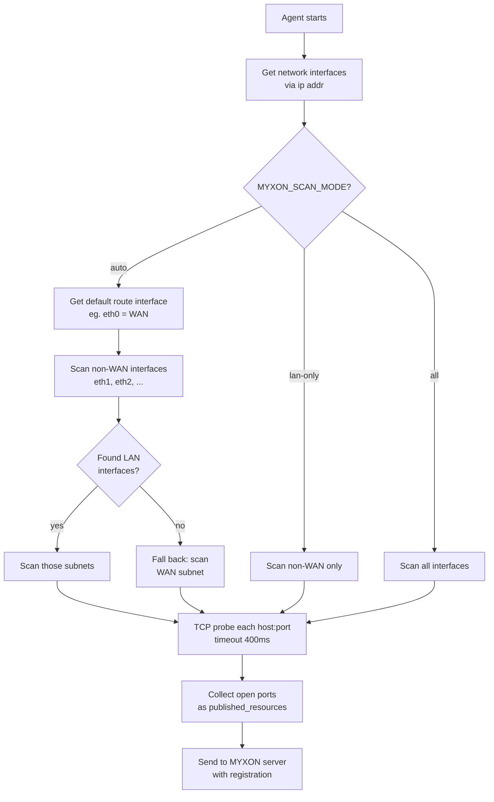

# LAN Auto-Discovery

The MYXON agent **automatically finds controllers** on the local network by scanning for known TCP ports. No IP configuration is required.

## How it works



## Known ports

The agent probes these ports on every host in the subnet:

| Port | Protocol | Service |
|------|----------|---------|
| 5843 | TCP | HOTRACO Remote+ |
| 5900 | VNC | VNC desktop |
| 80 | HTTP | Web UI |

::: tip Custom ports
If your controller uses a non-standard port, use the manual resource override:
```ini
MYXON_RESOURCES=[{"id":"myctrl","protocol":"tcp","host":"192.168.1.100","port":12345,"name":"My Controller"}]
```
:::

## Subnet size limit

Subnets larger than `/24` (more than 256 hosts) are skipped automatically. If your farm LAN is larger (e.g. `/16`), use the manual override instead.

## Re-discovery

The agent re-scans the LAN every `MYXON_DISCOVERY_INTERVAL` seconds (default: 60). If new controllers appear, it re-registers with the updated resource list and restarts the frpc tunnel.

## Router mode — Orange Pi as gateway

When Orange Pi has a **USB Ethernet adapter** connected to a dedicated industrial switch,
it can act as a full DHCP router — the same role as IXON's IXrouter.

```
Internet ──── eth0 (DHCP from uplink)
                    Orange Pi
USB Ethernet ── eth1 ──── switch ──── PLC 192.168.10.101
  (adapter)    (192.168.10.1)    └─── HMI 192.168.10.102
                                 └─── VNC 192.168.10.103
```

The `--lan-iface` flag in `install.sh` handles the full configuration:

| What | Result |
|------|--------|
| `eth1` static IP | `192.168.10.1/24` |
| dnsmasq | DHCP leases `.100`–`.200` on `eth1` only |
| sysctl | `ip_forward=1` persistent |
| iptables | NAT masquerade `eth1 → eth0` |
| `MYXON_LAN_IFACE` | Agent scans **only** `eth1` — never WAN subnet |

When `MYXON_LAN_IFACE` is set, it overrides `SCAN_MODE` entirely.
The agent logs: `Discovery: explicit LAN interface eth1 → 192.168.10.0/24`

## Scan mode decision guide

```
Q: Using --lan-iface / MYXON_LAN_IFACE (router mode)?
   YES → set automatically to lan-only, MYXON_LAN_IFACE controls exact interface.

Q: Does your Orange Pi have TWO ethernet ports?
   (one goes to WAN/internet, one goes to farm LAN)

  YES → Use MYXON_SCAN_MODE=lan-only
        The agent scans only the dedicated LAN port, never the WAN subnet.

  NO (single ethernet port) →
    Q: Is the single port connected to the same LAN as your controllers?

      YES → Use MYXON_SCAN_MODE=auto (default)
            Auto will scan the WAN-interface subnet as fallback.
            Works in single-NIC mode automatically.

      NO (unusual topology) → Use MYXON_SCAN_MODE=all
                               Or use manual MYXON_RESOURCES override.
```

## Performance

Discovery scans all hosts in the subnet in parallel with a 400ms TCP timeout. For a `/24` network (254 hosts) probing 3 ports:

- **254 × 3 = 762 concurrent connections**
- Typical scan time: **0.5–1.5 seconds**

If your device is resource-constrained, increase the discovery interval:
```ini
MYXON_DISCOVERY_INTERVAL=300  # Scan every 5 minutes instead of 1
```
