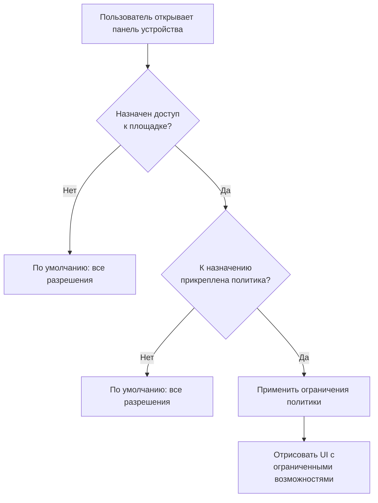

# Политики доступа

Политики доступа дают **администраторам-клиентам** тонкий контроль над тем, что каждый пользователь может делать на какой площадке. По умолчанию все вошедшие пользователи могут всё. Политики ограничивают конкретные возможности.

## Как работают политики

Политики применяются на уровне **пользователь + площадка**. Один пользователь может иметь полный доступ к Площадке A и только просмотр на Площадке B.

## Управление политиками

Перейдите в **Настройки → Политики доступа** (нужна роль админа).

> **Скриншот:** *Страница редактора политик: левая панель со списком трёх политик: «Полный доступ», «Инженер», «Только аварии». Правая панель показывает детали выбранной политики с переключателями для каждого разрешения.*

### Доступные разрешения

| Разрешение | Когда ограничено | Поведение UI |
|------------|------------------|--------------|
| `allow_hmi` | HOTRACO Direct HMI отключён | Раздел HMI скрыт |
| `allow_vnc` | Кнопка «Подключить VNC» отключена | Кнопка серая |
| `allow_http` | Кнопка «Подключить HTTP» отключена | Кнопка серая |
| `allow_alarms_view` | Панель аварий скрыта | Заменена предупреждением политики |
| `allow_alarms_acknowledge` | Кнопка «Подтвердить» скрыта | Кнопки нет |
| `allow_audit_view` | Журнал событий скрыт | Заменён предупреждением политики |

### Фильтр важности аварий

Дополнительно можно ограничить, какие важности аварий видит пользователь:

| Настройка | Эффект |
|-----------|--------|
| Все (по умолчанию) | Пользователь видит все аварии |
| Warning и выше | Аварии уровня info скрыты |
| Только critical | Видны только критичные |

## Назначить политику пользователю

1. Зайдите в **Настройки → Доступ к площадкам** (только админ)
2. Выберите площадку
3. Выберите пользователя из своего тенанта
4. Выберите его роль (Инженер / Наблюдатель) и опционально прикрепите политику
5. Сохраните

> **Скриншот:** *Страница «Доступ к площадкам»: таблица пользователей со столбцами Пользователь, Email, Роль, Политика доступа. У одного пользователя политика «Полный доступ», у другого — «Только аварии». Кнопки правки и удаления в каждой строке.*

::: tip Разрешающее поведение по умолчанию
Если вы не настроили ни одной политики, каждый пользователь в вашем тенанте имеет полный доступ ко всем устройствам. Заводите политики только когда нужно ограничить конкретных сотрудников (напр. внешних техников из сервисной компании).
:::

## Заведение дефолтных политик

Если начинаете с нуля, нажмите **Завести дефолтные политики**, чтобы создать три стартовые:

| Название политики | Что разрешает |
|-------------------|---------------|
| Полный доступ | Всё (как без политики) |
| Инженер | HMI + VNC + HTTP + аварии + подтверждение (без журнала аудита) |
| Монитор аварий | Только просмотр аварий (без удалённого доступа) |
