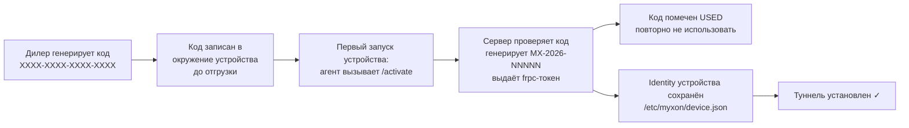

# Коды активации (Сценарий 2)

Коды активации — механизм провижининга для **OEM-партнёров**, у чьих устройств есть встроенный Linux-сервер. Вместо пред-регистрации серийника вы генерируете одноразовый код и разворачиваете его на устройстве. Устройство само регистрируется при первом запуске.

## Как работают коды активации



Один код может активировать **одно устройство**. После использования он навсегда израсходован. Если устройство вайпнули и перепрошили — нужен новый код.

## Сгенерировать код

1. Откройте вкладку **Портал дилера → Коды активации**
2. Опционально введите **Метку устройства** — человекочитаемое имя для назначения кода (напр. «Ферма Норд, блок #3»)
3. Выберите **срок действия** (7, 14, 30 или 90 дней)
4. Нажмите **+ Сгенерировать**

> **Скриншот:** *Форма «Сгенерировать код активации» с полем метки устройства, выпадающим TTL (выбрано 7 дней), кнопкой «Сгенерировать». Подсказка: «Сгенерируйте одноразовый код для устройств OEM-партнёра».*

## Скопировать код

После генерации код появляется в выделенной панели:

> **Скриншот:** *Панель сгенерированного кода: крупный моноширинный код «A3F1-B2E4-C9D7-0F56» в тёмном блоке, кнопка «Копировать» справа. Ниже: метка устройства, дата истечения и инструкция задать переменную MYXON_ACTIVATION_CODE.*

::: danger Скопируйте сейчас
Открытый текст кода показывается только один раз в этой панели. После закрытия или обновления код всё ещё виден в списке ниже — но обязательно скопируйте его перед развёртыванием.
:::

Задайте код как переменную окружения на устройстве (см. [OEM: Быстрая установка](/ru/oem/install)):
```bash
MYXON_ACTIVATION_CODE=A3F1-B2E4-C9D7-0F56
```

## Список кодов

Все коды вашего тенанта показаны в таблице:

> **Скриншот:** *Таблица кодов со столбцами: Код (моноширинный), Метка, Бейдж статуса (Ожидает/Использован/Истёк), дата истечения, кнопка «Отозвать».*

| Статус | Значение |
|--------|----------|
| **Ожидает** | Код сгенерирован, устройство ещё не активировано |
| **Использован** | Устройство успешно само зарегистрировалось этим кодом |
| **Истёк** | Срок действия прошёл до того, как устройство подключилось |

## Отозвать код

Вы можете отозвать любой **Ожидающий** код, который ещё не использован. Полезно, если код потерян, отправлен не на то устройство или отгрузка отменена.

Нажмите **Отозвать** рядом с кодом в списке. Использованные и истёкшие коды отозвать нельзя — они уже израсходованы.

::: info Безопасность кода
Каждый код — это 128-битный криптостойкий случайный токен формата `XXXX-XXXX-XXXX-XXXX`. Даже если кто-то получит код, он сможет использовать его только один раз и только до истечения.
:::
