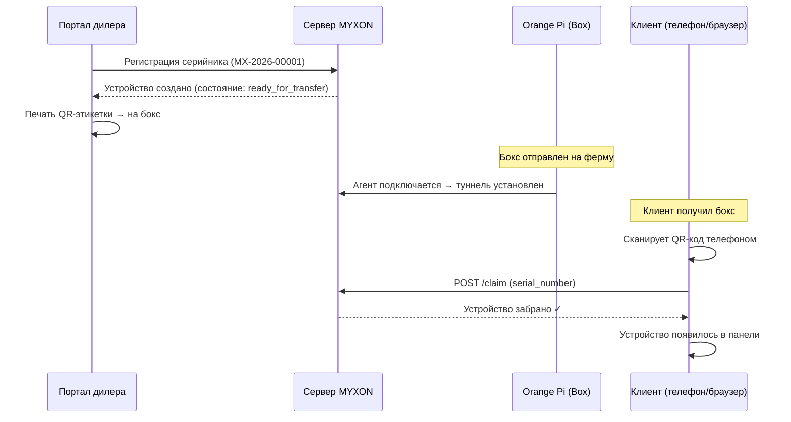
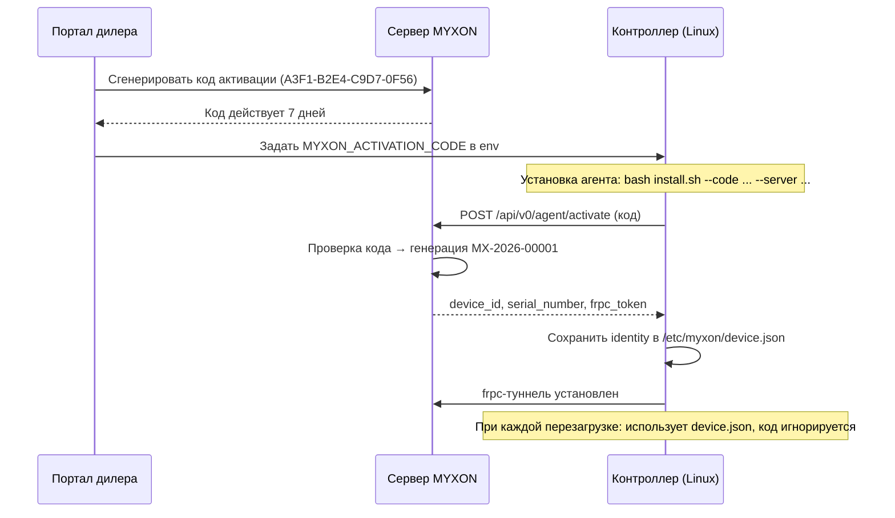

# Два сценария развёртывания

MYXON поддерживает два разных бизнес-сценария. Выберите тот, что подходит вашему продукту.

## Сценарий 1 — MYXON Box

**Вы продаёте железо. Агент предустановлен.**

Это типичная реселлерская модель. Вы берёте платы Orange Pi, прошиваете свой образ Debian с агентом MYXON и отправляете бокс клиенту вместе с контроллером.

### Поток

### Кто что делает

| Шаг | Кто | Инструмент |
|-----|-----|-----------|
| Зарегистрировать серийник | Дилер | Портал дилера → вкладка «Устройства» |
| Напечатать QR | Дилер | Портал дилера → «Печать QR-этикетки» |
| Отправить бокс | Дилер | Физическая доставка |
| Прошить + подключить | Дилер / техник | На объекте |
| Сканировать QR и забрать | Клиент | Мобильный браузер |

### Преимущества
- Просто для клиента — один скан QR активирует всё
- Работает, даже если устройство офлайн в момент активации (claim — это просто передача владения)
- Дилер может пред-зарегистрировать сотни серийников пакетом

---

## Сценарий 2 — OEM SDK

**У вашего контроллера уже есть Linux на борту. Вы встраиваете агента.**

Это модель OEM-интеграции. Вы производите контроллер (под своим брендом) со встроенным Linux-сервером. Вы ставите агента MYXON рядом со своим ПО.

### Поток

### Кто что делает

| Шаг | Кто | Инструмент |
|-----|-----|-----------|
| Сгенерировать код активации | Дилер | Портал дилера → вкладка «Коды активации» |
| Запустить `install.sh` на устройстве | Техник / завод | SSH или провижининг образа ОС |
| Первый запуск → авто-регистрация | Агент (автоматически) | Действий человека не нужно |
| Мониторить парк | Дилер | Портал дилера → вкладка «Устройства» |

### Преимущества
- Не нужно пред-регистрировать серийники — сервер генерирует их сам
- Работает в заводских / пакетных провижининг-конвейерах
- Код активации строго одноразовый — не переиграть

---

## Сравнение

| Свойство | Сценарий 1 (MYXON Box) | Сценарий 2 (OEM SDK) |
|----------|------------------------|----------------------|
| Железо | Ваш продукт на Orange Pi | Контроллер партнёра |
| Установка агента | Предустановлен в образе | `install.sh` партнёром |
| Регистрация | Дилер пред-регистрирует серийник | Код генерируется на устройство |
| Активация клиентом | Скан QR-кода | Автоматически при первом запуске |
| Источник серийника | Назначает дилер | Сервер генерирует авто |
| Шаг claim клиентом | Обязателен | Опционален (устройство уже claimed) |
