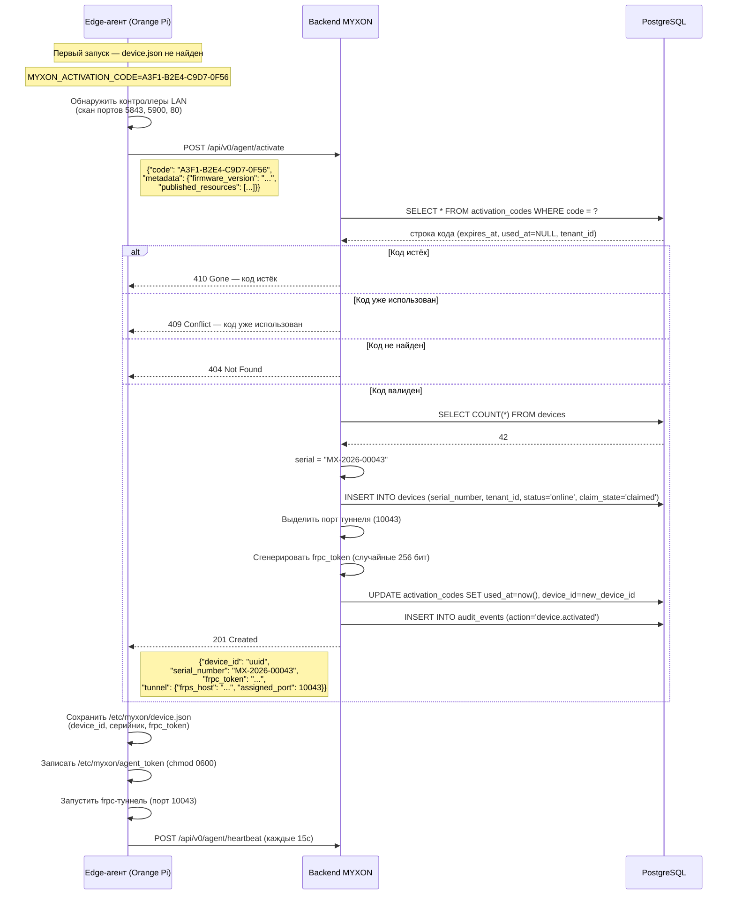

# Поток кода активации — техническая справка

Эта страница объясняет точное взаимодействие с API при саморегистрации устройства — для разработчиков и интеграторов, которым нужно понять или расширить поток.

## Полная последовательность



## Эндпоинт API

```
POST /api/v0/agent/activate
Content-Type: application/json
(заголовок Authorization не требуется)
```

### Тело запроса

```typescript
{
  code: string              // Код активации: "XXXX-XXXX-XXXX-XXXX"
  metadata?: {
    firmware_version?: string
    hardware_info?: string
    model?: string
    published_resources?: Resource[]
  }
}

interface Resource {
  id: string           // напр. "remote-plus"
  protocol: string     // "tcp" | "vnc" | "http"
  host: string         // LAN-IP контроллера
  port: number         // LAN-порт
  name: string         // Человекочитаемое имя
}
```

### Ответ (201 Created)

```typescript
{
  accepted: true
  device_id: string          // UUID нового устройства
  serial_number: string      // Сгенерирован: "MX-2026-00043"
  frpc_token: string         // Сохраните — больше не присылается
  tunnel: {
    frps_host: string        // Хост сервера frps
    frps_port: number        // Порт привязки frps (по умолчанию 7000)
    assigned_port: number    // Уникальный порт для туннеля этого устройства
    subdomain: string | null // Опциональная поддомен-маршрутизация
  }
}
```

### Ответы с ошибками

| Статус | Когда |
|--------|------|
| `404 Not Found` | Код не существует |
| `409 Conflict` | Код уже использован другим устройством |
| `410 Gone` | Код истёк |

## Формат серийного номера

Серийные номера генерируются автоматически:

```
MX-{ГОД}-{ПОСЛЕДОВАТЕЛЬНОСТЬ}
```

- `{ГОД}` — 4-значный год активации
- `{ПОСЛЕДОВАТЕЛЬНОСТЬ}` — 5-значный счётчик устройств на момент активации, дополненный нулями

Пример: `MX-2026-00043` — 43-е устройство, активированное в 2026 году.

::: warning Не настоящая DB-последовательность
Текущая реализация использует `SELECT COUNT(*) FROM devices` для определения следующего номера. В сценариях высокой конкурентности (несколько активаций точно в один момент) есть малый шанс коллизии — уникальное ограничение БД отклонит дубликат, устройство получит ошибку 500 и повторит попытку. Для типичных OEM-развёртываний (по одному устройству за раз) это не проблема.
:::

## Свойства безопасности

| Свойство | Как обеспечивается |
|----------|-----------------|
| Одноразовость | `used_at` ставится при первом использовании; сервер отклоняет последующие вызовы |
| Срок годности | `expires_at` проверяется на стороне сервера при каждом запросе |
| Авторизация не нужна | Сам код ЯВЛЯЕТСЯ доказательством авторизации |
| frpc_token выдаётся однажды | Возвращается только в ответе 201; последующие регистрации используют его без повторной выдачи |
| Токен хранится безопасно | Сохраняется в файл `chmod 0600`; никогда не логируется |
