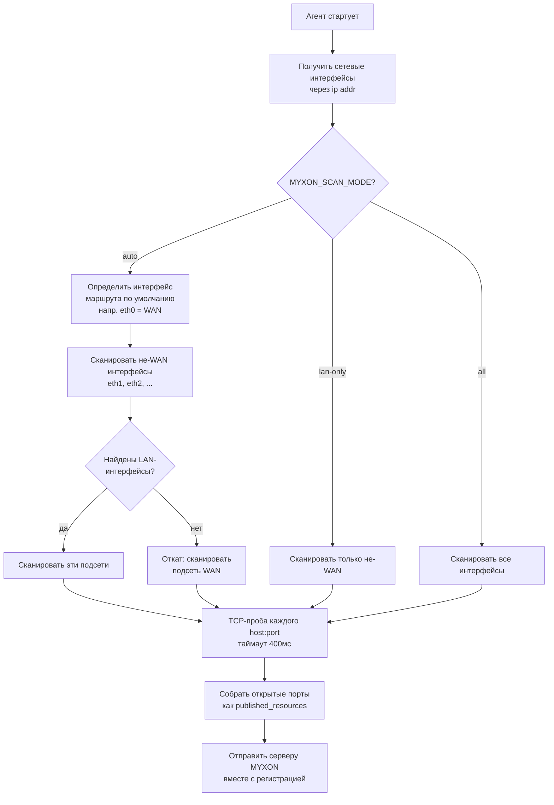

# Авто-обнаружение в LAN

Агент MYXON **автоматически находит контроллеры** в локальной сети, сканируя известные TCP-порты. Настройка IP не требуется.

## Как это работает



## Известные порты

Агент пробит эти порты на каждом хосте в подсети:

| Порт | Протокол | Сервис |
|------|----------|---------|
| 5843 | TCP | HOTRACO Remote+ |
| 5900 | VNC | VNC-десктоп |
| 80 | HTTP | Web UI |

::: tip Свои порты
Если ваш контроллер использует нестандартный порт, задайте ресурс вручную:
```ini
MYXON_RESOURCES=[{"id":"myctrl","protocol":"tcp","host":"192.168.1.100","port":12345,"name":"My Controller"}]
```
:::

## Ограничение размера подсети

Подсети больше `/24` (более 256 хостов) пропускаются автоматически. Если ваша ферм-LAN больше (напр. `/16`), используйте ручное переопределение.

## Пере-обнаружение

Агент пере-сканирует LAN каждые `MYXON_DISCOVERY_INTERVAL` секунд (по умолчанию: 60). Если появляются новые контроллеры, он пере-регистрируется с обновлённым списком ресурсов и перезапускает frpc-туннель.

## Режим роутера — Orange Pi как шлюз

Когда у Orange Pi есть **USB Ethernet-адаптер**, подключённый к выделенному промышленному коммутатору,
он может работать полноценным DHCP-роутером для нижестоящей сети ПЛК/HMI.

```
Интернет ──── eth0 (DHCP от аплинка)
                    Orange Pi
USB Ethernet ── eth1 ──── коммутатор ──── ПЛК 192.168.10.101
  (адаптер)    (192.168.10.1)    └─── HMI 192.168.10.102
                                 └─── VNC 192.168.10.103
```

Флаг `--lan-iface` в `install.sh` берёт на себя всю настройку:

| Что | Результат |
|------|--------|
| Статический IP `eth1` | `192.168.10.1/24` |
| dnsmasq | DHCP-аренды `.100`–`.200` только на `eth1` |
| sysctl | `ip_forward=1` постоянно |
| iptables | NAT-маскарад `eth1 → eth0` |
| `MYXON_LAN_IFACE` | Агент сканирует **только** `eth1` — никогда подсеть WAN |

Когда задан `MYXON_LAN_IFACE`, он полностью переопределяет `SCAN_MODE`.
Агент логирует: `Discovery: explicit LAN interface eth1 → 192.168.10.0/24`

## Гид по выбору режима сканирования

```
В: Используете --lan-iface / MYXON_LAN_IFACE (режим роутера)?
   ДА → автоматически ставится lan-only, MYXON_LAN_IFACE задаёт точный интерфейс.

В: У вашего Orange Pi ДВА ethernet-порта?
   (один в WAN/интернет, один в ферм-LAN)

  ДА → Используйте MYXON_SCAN_MODE=lan-only
       Агент сканирует только выделенный порт LAN, никогда подсеть WAN.

  НЕТ (один ethernet-порт) →
    В: Единственный порт подключён к той же LAN, что и контроллеры?

      ДА → Используйте MYXON_SCAN_MODE=auto (по умолчанию)
           Auto просканирует подсеть WAN-интерфейса как откат.
           Работает в одно-NIC режиме автоматически.

      НЕТ (нетипичная топология) → Используйте MYXON_SCAN_MODE=all
                                    Или ручное переопределение MYXON_RESOURCES.
```

## Производительность

Обнаружение сканирует все хосты подсети параллельно с TCP-таймаутом 400мс. Для сети `/24` (254 хоста) при пробе 3 портов:

- **254 × 3 = 762 параллельных соединения**
- Типичное время скана: **0.5–1.5 секунды**

Если ваше устройство ограничено по ресурсам, увеличьте интервал обнаружения:
```ini
MYXON_DISCOVERY_INTERVAL=300  # Сканировать каждые 5 минут вместо 1
```
